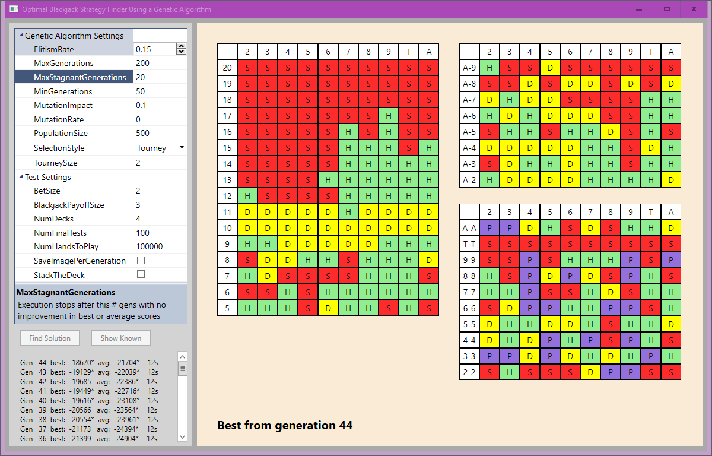

# machine-learning-blackjack-solution
 
## Introduction
A *genetic algorithm* is a type of artificial intelligence programming that uses ideas from evolution to solve complex problems.

It works by creating a population of (initially random) candidate solutions, then repeatedly selecting pairs of candidates and combining their solutions using a process similar to genetic crossover.  

Sometimes candidate solutions even go through mutation, just to introduce new possibilities into the population.  

After a large number of generations, the best solution found up to that point is often the optimal, best solution possible.

Genetic algorithms are particularly well-suited for combinatorial problems, where there are huge numbers of potential solutions to a problem.  The evolutionary process they go through is, in essence, a search through a huge solution space.  A solution space so large that you simply could never use a brute force approach.

This project is a demonstration of using a genetic algorithm to find an optimal strategy for playing the casino game [Blackjack](https://en.wikipedia.org/wiki/Blackjack).

The source code is for a Windows application written in C# that allows you to play with different settings like population size, selection style and mutation rate.  Each generation's best solution is displayed, so you can watch the program literally evolve a solution.





The property grid located at the upper left of the screen is where you adjust settings.  There's an informational area below that, and the right side of the screen is the display area for the three tables that represent a strategy for playing Blackjack.

The tall table on the left is for *hard hands*, the table in the upper right is for *soft hands*, and the table in the lower right is for *pairs*.  We'll talk more about how to interpret this strategy in a bit.

The columns along the tops of the three tables are for the dealer upcard.  When you play Blackjack the dealer has one of his two cards initially turned face up, and the rank of that card has a big impact on recommended strategy.

Notice that the upcard ranks don't include Jack, Queen or King.  That's because those cards all count 10, so we group them and the Ten together and simplify the tables.


## A Word About This "Optimal" Strategy
Before we go any further, it needs to be stated that this problem of finding an optimal Blackjack strategy has already been solved.  

Back in the 1960s, a mathematician named [Edward O. Thorp](https://en.wikipedia.org/wiki/Edward_O._Thorp) authored a book called *Beat the Dealer*, which included charts showing the optimal "Basic" strategy.  That strategy looks like this:


So we're solving a problem that has already been solved, but that's actually good.  That means we can compare our results to the known best solution.

There's one other thing to get out of the way before we go any further, and that's *nondeterministic code*.  That means that if we run the same code twice in a row, we're likely to get two different results.  That's something that happens with genetic algorithms.  There's no guarantee you'll find the absolute optimal solution, but it is assured that you will find *an* optimal or near-optimal solution.  It's something that isn't typical when writing code, so it takes some adjustment.

## Genetic Algorithms
Now let's talk about the details of a genetic algorithm.

### Fitness Scores
First of all, we need a way to evaluate candidates so we can compare them to each other.  That means a numeric *fitness score*, which in this case is quite simple: you simulate a fixed number of hands following the strategy, and then count the number of chips you have at the end.

The big question is, how many hands should we test with?  The challenge of trying to test a strategy is that due to the innate randomness of Blackjack, you could use the same strategy ten times and get ten completely different results.

Obviously, the more hands you play, the more the randomness gets smoothed out, and the quality of the underlying strategy starts to emerge.  After some testing and analysis, it seems like a minimum of 100,000 hands per test is needed.  There's still variance even at that number, but in order to cut the variance in half, you'd need to bump the number of hands to 500,000.


### Representation
*Representation* is simply the idea that we need to use a data structure for a candidate solution that can be combined via crossover, and possibly mutated.  

In this case, that's also quite simple because the way that human beings represent a Blackjack strategy is to use three tables, as we've seen.  Representing those in code with three two-dimensional arrays is the obvious approach.

Each cell in those three tables will have "Hit", "Stand", "Double-Down", or (only for pairs) "Split".  

By the way, since there are 160 cells in the hard hands table, and 80 cells in the soft hands table, and 100 cells in the pairs table, we can calculate exactly how many possible distinct strategies there are for Blackjack:

4<sup>100</sup> x 3<sup>80</sup> x 3<sup>160</sup> = 5 x 10<sup>174</sup> possible Blackjack strategies

That's a big number, which is obviously impossible to search using brute force.  Genetic algorithms (GAs) are extremely helpful when trying to find an optimal solution from a very large set of possible solutions like this.
  
## Blackjack Rules and Strategies
The [rules of Blackjack](https://en.wikipedia.org/wiki/Blackjack) are fairly simple.  The dealer and the player both are dealt two cards.  The player sees both of their cards (they are usually dealt face up), and one of the dealer's cards is dealt face up.  

Each card has a value - for cards between 2 and 10, the value is the same as the card's rank (so an Eight of Spades counts as 8, for example).  All face cards count as 10, and an Ace can either be 1 or 11 (it counts as 11 only when that does not result in a hand that exceeds 21).  The suit of a card does not matter.
 
After the cards are dealt, if the player has Blackjack (a total of 21) and the dealer does not, the player is immediately paid 1.5 times their original bet, and a new hand is dealt.  If the player has 21 and the dealer does also, then it's a tie and the player gets their original bet back, and a new hand is dealt.
 
If the player wasn't dealt a Blackjack, then play continues with the player deciding whether to Stand (not get any more cards), Hit (receive an additional card), Double-down (place an additional bet, and receive one and only one more card), or, in the case of holding a pair, splitting the hand, which means placing an additional bet and receiving two new cards, so the end result is that the player is now playing two (or, in the case of multiple splits, more than two) hands simultaneously.
 
If the player hits or double-downs and has a resulting hand that exceeds 21, then they lose and play continues with the next hand.  If not, then the dealer draws until their hand totals at least 17.  If the dealer exceeds 21 at this point, the player receives a payment equal to twice their original bet.  If the dealer doesn't exceed 21, then the hands are compared and the player with the highest total that doesn't exceed 21 wins.
 
Because of these rules, certain effective strategies emerge.  One common strategy is that if you hold a hard hand with a value of 20, 19 or 18, you should Stand, since you avoid busting by going over 21, and you have a nice hand total that might win in a showdown with the dealer.  
 
Another common strategy is to split a pair of Aces, since Aces are so powerful (due to the fact that count as 11 or 1, you can often Hit a hand with a soft Ace with no risk of busting).  Likewise, splitting a pair of 8s is a good idea because with a hard total of 16, it's likely you will bust if you take a Hit (since so many cards count as 10).

As a human being, all it takes is a little knowledge about the rules in order to construct a strategy.  The GA program doesn't have that advantage, and operates completely without any pre-programmed knowledge of Blackjack.  It simply uses the relative fitness scores and the mechanism of evolution to find the solution.

## GA Settings
There are many variables or settings for a GA.  You can adjust population size, how parent candidates are selected, how the resulting children may be mutated, and several other items.  The following sections describe some of these settings:
 
### Setting: Selection Style
Once we've solved representation and have a fitness function, the next step is to select two candidates for crossover during the process of building a new generation.  

There are three common styles for selection, and this program supports all of them.
 
First, you can choose `Roulette Wheel` selection.  It's named for a Roulette wheel because you can imagine each candidate's fitness score being a wedge in a pie chart, with a size proportionate to its relative fitness compared to the other candidates.  (Of course, this assumes that all fitness scores are positive, which we will talk about shortly).  

The main benefit of Roulette Wheel selection is that selection is fitness-proportionate.  Imagine if you had only three candidates, with fitness scores of 1, 3, and 8.  The relative selection probabilities for those candidates will be 1/12, 3/12, and 8/12.  
 
The downside of Roulette Wheel selection is that it tends to be somewhat slow in terms of processing.  The selection process is done by iterating through the candidates until a particular condition is matched - in other words, O(N) performance.  
 
Another potential problem with Roulette Wheel selection is that there may be situations where fitness scores vary widely, to such an extent that only certain candidates have any reasonable chance of being selected.  This happens frequently in early generations, since the majority of candidates are mostly random.  

Although this might sound like a positive (since you ultimately want to select candidates with high fitness scores), it also results in a loss of genetic diversity.  In other words, even though a particular candidate may have a low fitness score in an early generation, it may contain elements that are needed to find the ultimate solution in later generations.
 
`Ranked Selection` is the solution to this problem.  Instead of using raw fitness scores during the selection process, the candidates are sorted by fitness, with the worst candidate receiving a score of 0, the second worse receiving 1, and so forth, all the way to the best candidate, which has a score equal to the population size - 1.  
 
Ranked Selection is quite slow, since it combines the O(N) performance of Roulette Wheel, with the additional requirement that the candidates be sorted before selection.  However, there may be circumstances where it performs better than other selection approaches.
 
Finally, the fastest selection method of all is called `Tournament Selection`.  This method simply selects N random candidates from the current generation, and then uses the one with the best fitness score.  

A tournament size of 2 means two random candidates are selected, and the best of those two is used.  If you have a large tournament size (like 10), then 10 different candidates will be selected, with the best of those being the ultimate selection.  That obviously tilts the balance between randomness and quality.
 
Tournament selection works well in most cases, but it does require some experimentation to find the best tourney size.  
 
### Setting: Elitism
*Elitism* is a technique that helps ensure that the best candidates are always maintained.  

Since all selection methods are random to some degree, it is possible to completely lose the best candidates from one generation to another.  By using Elitism, we automatically advance a certain percentage of the best candidates to the next generation.  

Elitism does have a negative impact on performance since all of the candidates must be sorted by fitness score.
 
Typically Elitism is done before filling the rest of a new generation with new candidates created by crossover.
 
### Crossover Details
Once two candidate solutions have been selected, the next step in building a new generation is to combine those two into a single new candidate, hopefully using the best of both parent strategies.  

There are a number of ways to do crossover, but the method used in this program is quite straightforward - the two fitness scores are compared, and crossover happens in a relatively proportionate way.  If one candidate has a fitness of 10, and the other has a fitness of 5, then the one with fitness 10 contributes twice as much to the child as the parent with a fitness of 5.
 
Since the fitness scores in this program are based on how much the strategy would win over thousands of hands, almost all fitness scores will be negative.  (This is obviously because the rules are set up so the house always wins.)

This makes it difficult to calculate relative fitnesses (how do you compare a positive number with a negative, and find relative proportions?), and also causes problems with selection methods like Roulette Wheel or Ranked.  

To solve this, we find the lowest fitness score of the generation and add that value to each candidate.  This results in an adjusted fitness score of 0 for the very worse candidate, so it never gets selected.
 
 
### Mutation
As has been mentioned a few times, maintaining genetic diversity in our population of candidate solutions is a good thing.  It helps the GA ultimately find the very best solution, by occasionally altering a candidate in a positive direction.  

There are two settings for mutation.  `MutationRate` controls what percentage of new candidates have mutation done on them.  `MutationImpact` controls what percentage of their strategy is randomized.
  
### Population Size
Population size has a significant impact on performance.  The smaller the population size, the faster the GA will execute.  On the other hand, if the size is too low the population may not have enough genetic diversity to find the ultimate solution.  During testing, it looks like 700 to 1000 is a good balance between speed and correctness.
 
## Performance Notes
This program consumes a lot of processing power.  Running tests of hundreds of thousands of hands of Blackjack for hundreds or thousands of candidates consumes a lot of time.  It's really imperative to write the code so that it works as efficiently as possible.  If your CPU isn't consistently at or above 95% usage, there's still room for improvement.

Multi-threading is a natural fit for genetic algorithms because we often want to perform the same action on each candidate.  The best example of this is when we calculate fitness scores.  This is often an operation that takes quite a bit of time.  In our case, we're dealing out 100,000 hands, and each hand has to be played until the end.  If we're single-threading that code, it's going to take a long time.  Multi-threading is really the way to go.
 
Luckily, there's a ridiculously simple way to efficiently use all of your processors for an operation like this.  This code loops over all of the candidates in the currentGeneration list, calls the fitness function and sets the fitness property for each:
 
```csharp
Parallel.ForEach(currentGeneration, (candidate) =>
{
    candidate.Fitness = FitnessFunction(candidate);
});
```
 
Regardless of the number of items in the list or the number of processors on your machine, the code will efficiently run the code in a multi-threaded manner, and continue only when all of the threads are complete.
 
One of the side effects of making this code multi-threaded is that all of the code relating to evaluating a candidate must be thread-safe, including any Singleton objects.  When making code thread-safe, pay attention that you don't accidentally introduce code that will slow your program down unintentionally, because sometimes it can be quite subtle.
 
Random numbers are central to how genetic algorithms work, so it's critical that they can be used correctly from a multithreaded environment.  That means that each random number generator must be separate from the others, and it also means that each must produce a distinct series of random numbers.

Random number generators use seed values which are usually time-based, like the number of milliseconds the computer has been turned on.  Starting with that seed, subsequent calls will return a series of numbers that look random, but really aren't.  If you start with the same seed, you get the same sequence.  
 
And that's a problem because if you create multiple random number generator objects in a loop using the default time-based seed, several of them will have the same time-based initial seed value, which will result in the same sequence of "random" numbers.  That's a bug, because it can reduce the true randomness of the program a great deal, and that's vital to a genetic algorithm.

There are a couple of ways to solve this problem.  First, you can make the random object truly a singleton, and restrict access to it by using a C# `lock` statement.  The makes all access serialized for any random number need, which reduces performance.

Another approach is to make the variable static per thread.  By declaring the variable as `static` and also marking it with the `[ThreadStatic]` attribute, the .NET runtime allocates one static variable per thread.  That eliminates the locking/serialization, but also has performance issues.

The approach used in this application is to use a non-default seed value.  In this case we call `Guid.NewGuid().GetHashCode()`, which generates a new, unique GUID, then gets an integer value that will be unique, or really close to it, depending on how `GetHashCode` is implemented.

While multithreading really helps performance, there are also other things we can do to improve performance.  For example, when dealing with large populations, the hundreds or thousands of objects that will be generated each generation can quickly turn into a huge problem related to garbage collection.

In the end, the easiest way to solve that is to look through the code and find objects being allocate inside a loop.  It's better to declare the variable outside of the loop, and then clear it in the loop, rather than reallocate it.  In a program like this one where you could be looping hundreds of thousands of times, this can result in a very significant performance boost.

For example, in an early version of this code, a Deck object was created for each hand.  Since there are hundreds of candidate solutions running hundreds of thousands of trial hands, this was a huge inefficiency.  The code was changed to allocate one deck per test sequence.  The deck was shuffled as needed, so it never needs to be reallocated.

Beyond the cards in the deck, another object type that was repeatedly created and destroyed were the candidate strategies.  To mitigate this problem, a StrategyPool class was created that handleds allocation and deallocation.  This means that strategy objects are reused, rather than dynamically created when needed.  The pool class has to be thread-safe, so it does serialize access to its methods via a C# lock statement, but overall using the pool approach produced a good performance increase.

Finally, a subtle form of object allocation is conversion.  In an early version of the code, a utility card function used `Convert.ToInt32(rankEnum)`.  Obviously, the easiest way to convert from an enum to an int is simply to cast it, like `(int)rankEnum`.  But many programmers don't know whether to use that approach, `int.Parse()`, `int.TryParse()`, or `Convert.ToInt32()`, since they can all be used.

Perhaps the compiler was boxing the enum value before passing it to `Convert.ToInt32()`, because the profiler identified this as a function that had large amounts of thread contention waiting - and the problem got much, much worse as the generations passed.  By rewriting the conversion to use a simple cast, the program performance increased threefold (3x).

 
## Contributing
Please read [CONTRIBUTING.md](CONTRIBUTING.md) for details on our code of conduct, and the process for submitting pull requests to us.
 
## Author
* **Greg Sommerville** - *Initial work* 
 
## License
This project is licensed under the Apache 2.0 License - see the [LICENSE.md](LICENSE.md) file for details